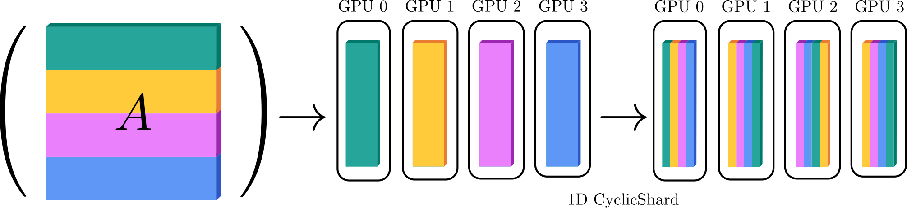

# Summary

Solving linear systems and eigenvalue problems is central to scientific computing. Early digital
computers were already built to perform tasks such as LU factorization [@Wilkinson1948], which underpins
the solution of linear systems of the form $Ax=b$. Because these operations appear throughout applied
mathematics, a mature ecosystem of dense linear algebra libraries exists and is highly optimized for
CPUs and, increasingly, GPUs.

JAXMg provides distributed dense linear algebra routines in JAX, targeting multi-GPU execution. It
bridges JAX workflows with GPU-accelerated solver backends, enabling scalable linear solves and
eigendecompositions within JAX-based scientific applications.

# Statement of need

Modern scientific computing increasingly relies on GPUs, which now provide a large fraction of the
available floating-point throughput in both leadership-class supercomputers and smaller multi-GPU
workstations. At the same time, dense linear algebra remains a critical building block for many
numerical methods. A number of mature libraries therefore provide high-performance linear algebra on
CPUs and GPUs, including distributed and accelerator-aware packages such as ScaLAPACK
[@blackford1997scalapack], MAGMA [@abdelfattah2024magma], and SLATE [@gates2019slate].

In parallel, JAX [@jax2018github] has become a widely adopted framework for scientific computing
because it combines a NumPy-like user experience with just-in-time (JIT) compilation and automatic
differentiation. The JAX ecosystem has expanded rapidly, with libraries for neural networks
[@flax2020github], Bayesian inference [@cabezas2024blackjax], differential equations [@kidger2021on],
Variational Monte Carlo [@netket3:2022]
and full physics simulation environments [@brax2021github]. These workflows often require repeatedly
solving linear systems or computing eigenvalue decompositions, either as part of a larger simulation
loop or inside differentiable optimization.

Despite this growth, the JAX ecosystem lacks distributed dense linear algebra routines that scale
across multiple GPUs while remaining usable from idiomatic JAX programs. This gap makes it
challenging to take existing JAX-based scientific applications to problem sizes that exceed a single
GPU, or to integrate multi-GPU linear algebra into end-to-end JAX pipelines.

JAXMg addresses this need by providing a distributed multi-GPU interface to GPU-accelerated solver
backends, enabling scalable linear solves and eigendecompositions from within JAX. 

# Software design

JAXMg connects JAX to NVIDIA’s multi-GPU dense linear algebra library cuSOLVERMg [@cusolver] via an
XLA Foreign Function Interface (FFI) C++ extension. This design enables writing complex,
JIT-compatible JAX programs while delegating the compute-intensive and communication-sensitive
components to a compiled backend.

The current release provides a jittable interface to the cuSOLVERMg routines `potrs`, `potri`, and
`syevd`:

- `cusolverMgPotrs`: Solves $Ax=b$ for symmetric (Hermitian) positive-definite $A$ using a Cholesky factorization. 
- `cusolverMgPotri`: Computes the inverse of a symmetric (Hermitian) positive-definite matrix from its Cholesky factorization.
- `cusolverMgSyevd`: Computes eigenvalues and eigenvectors of a symmetric (Hermitian) matrix.

All routines support JAX dtypes `float32`, `float64`, `complex64`, and `complex128`. JAXMg supports
CUDA 12 and CUDA 13 compatible devices.

For example, the `potrs` routine can be called like this over a 1D mesh `mesh = jax.make_mesh((jax.device_count(),), ("x",))`:

```python
out = potrs(A, b, T_A=T_A, mesh=mesh, in_specs=(P("x", None), P(None, None)))
```
Here, `A` is an $N\times N$ positive-definite matrix that is sharded row-wise over the available
devices: `jax.device_put(A, NamedSharding(mesh, P("x", None)))`. The right-hand side `b` has shape
$N \times N_{\mathrm{RHS}}$ and is replicated across devices:
`jax.device_put(b, NamedSharding(mesh, P(None, None)))`. The tile size $T_A$ is user-configurable and
controls the trade-off between memory usage and performance; larger tiles typically improve
throughput (see Benchmark).

## 1D Cyclic Data Distribution

Parallelized linear algebra algorithms require a distributed data layout to ensure proper load
balancing of the available computational power [@dongarra1994]. JAXMg constructs the required 1D
block-cyclic layout in the C++ backend.

In this 1D scheme, columns are assigned to GPUs in fixed-size tiles of $T_A$ columns, distributed in round-robin order across the available devices. Given a global matrix dimension $N$, we first construct an explicit mapping from each global source column index to its destination column index in the target 1D block-cyclic layout.

To apply this redistribution efficiently in-place, we decompose the column-index mapping into disjoint permutation cycles. Each cycle specifies a sequence of columns that must be rotated to reach the target layout, and we execute these rotations using peer-to-peer GPU copies (e.g., `cudaMemcpyPeerAsync`) together with two small staging buffers to avoid overwriting data before it is forwarded. This yields a deterministic procedure for converting between contiguous per-device column storage and the 1D block-cyclic distribution required by cuSOLVERMg. See \autoref{fig:jaxmg_cyclic} for a schematic depiction.

{ width=100% }


## Memory management

For parallel execution, JAXMg supports Single Program Multiple Devices (SPMD) and Multi Program
Multiple Devices (MPMD) modes. In both cases, we use the `jax.shard_map` primitive to expose each
device’s local shard and pass the corresponding GPU pointers into the backend.

At execution time, `shard_map` launches one thread (SPMD) or one process (MPMD) per GPU. However, the
cuSOLVERMg API must be called from a single thread/process that can access all GPU pointers. Hence we need
to make all shard pointers visible to that caller.

In the SPMD case, all threads share a single virtual address space, so sharing pointers is
straightforward: we create a POSIX shared-memory region that stores the per-device pointers
and each thread assigns its respective shard to the shared array.

In the MPMD case, each process has its own virtual address space, and directly sharing device
pointers across processes is undefined. CUDA therefore provides low-level inter-process
communication via the `cudaIpc` API, which allows GPU allocations to be shared between processes. We
illustrate the SPMD and MPMD approaches schematically in \autoref{fig:jaxmg_shm}.

{ width=100% }


# Benchmark

To demonstrate the usefullness of this package we benchmark 

8 H200s with 143gb of VRAM. We highlight the three cases. potrs with f32. syevd with f64 and potri with complex128.

Scaling is consistent with O(N^3) scaling of all these algorithms. 

# AI usage disclosure

Github Copilot was used for debugging purposes when developing the code. 

# Acknowledgements

I want to thank Dennis Bollweg, Alex Chavin, Geraud Krawezik, Dylan Simon and Nils Wentzell for their help with developing the code. I also want to acknowledge the help of Ao Chen and Riccardo Rende with testing the code in applied settings.  
I am grateful to Simon Tartakovsky for his suggestions on the 1D cyclic algorithm. Finally, I want to thank
 Filippo Vincentini for his suggestions on code distribution. I acknowledge support from the Flatiron Institute. The Flatiron Institute is a division of the Simons Foundation. 


# References